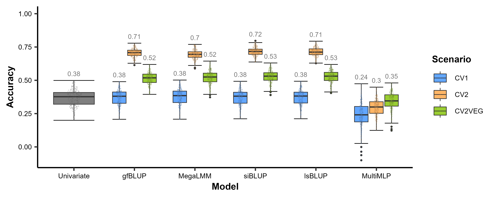
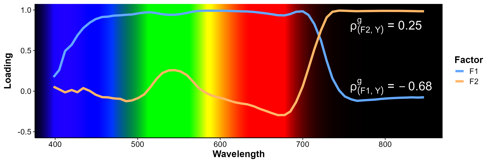
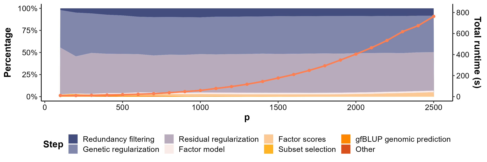

# Improving Genomic Prediction using High-dimensional Secondary Phenotypes: The Genetic Latent Factor Approach

This repository contains all scripts required to generate the simulated, hyperspectral, and timing data. It also contains scripts to analyze the datasets using different methods and visualize the results, as in the paper. The individual scripts can all be run conveniently from three main files that source all scripts, [`run_all_p800.R`](run_all_p800.R), [`run_all_hyper.R`](run_all_hyper.R), and [`run_all_timing.R`](run_all_timing.R).

## 1 - High-dimensional (p=800) simulated data

This section provides some additional information on the generation and analysis of the high-dimensional simulated data. All required scripts can be run one after the other using [`run_all_p800.R`](run_all_p800.R). Do note that all analyses together take a significant amount of time.

### 1.1 - Data simulation

Two scripts are used to generate that data. The first one ([`generate_sim_p800_datasets.R`](p800/data_generation/generate_sim_p800_datasets.R)) simulates the actual data based on the factor model while [`traintest_sim_p800_datasets.R`](p800/data_generation/traintest_sim_p800_datasets.R) randomly divides each dataset into a training and test set. Note that these scripts can be run in WSL2 using Intel's oneMKL BLAS and LAPACK libraries for a signficant speedup. In that case `MKL_DYNAMIC` and `MKL_NUM_THREADS` must be set to `FALSE` and `3`, respectively. This assumes a 20 thread system (5 parallel processes each using 3 threads for MKL). For an 8 thread system `MKL_NUM_THREADS` should be set to `1`. If unsure, set `MKL_NUM_THREADS` to `1` or just run in Windows.

### 1.2 - Data analysis

[`run_all_p800.R`](run_all_p800.R) sources all scripts to analyze the generated data using different methods, as well as some scripts to merge results for methods that are run in multiple parts due to their long runtime. As an example, [`gfBLUP_part1.R`](p800/analyses/gfBLUP_part1.R) is responsible for analyzing the first 50 datasets for each of the combinations of focal/secondary trait heritabilities and focal trait communalities. The second 50 datasets are analyzed using [`gfBLUP_part2.R`](p800/analyses/gfBLUP_part2.R) after which the results are merged using [`gfBLUP_merge.R`](p800/misc/gfBLUP_merge.R). Note that if running the scripts in WSL2 using oneMKL, it is safest to set `MKL_NUM_THREADS=1` and `MKL_DYNAMIC=FALSE` to avoid issues with explicit parallelization.

### 1.3 - Result visualization

The results of all p800 analyses are visualized using [`plot_p800_results.R`](p800/plot_p800_results.R). The produced plot (p800.png) is placed in the [plots](plots) directory.

## 2 - Hyperspectral data

This section provides additional information on the pre-processing and analysis of the [CIMMYT hyperspectral data](https://doi.org/10.1534/g3.118.200856). All required scripts can be run one after the other using [`run_all_hyper.R`](run_all_hyper.R). Do note that all analyses together take a significant amount of time.

### 2.1 - Data pre-processing

The [`generate_hyper_datasets.R`](hyper/data_generation/generate_hyper_datasets.R) script takes care of generating the kinship and cleaned up marker matrices which are subsequently saved in the [genotypes](genotypes) directory. It also generates the 250 pseudo-CRD datasets after correcting for design effects. The 250 random train/test divisions are based on the trials (26 training trials and 13 test trials).

### 2.2 - Data analysis

After generation of the 250 datasets, [`run_all_hyper.R`](run_all_hyper.R) sources the scripts that perform the analyses using the different methods, saving the results. This takes far less time than then simulated data analyses.

### 2.3 - Result visualization

The results are visualized using [`plot_hyper_results.R`](hyper/plot_hyper_results.R).

### 2.4 - Interpretation of methods for a single date

We look at gfBLUP, siBLUP, lsBLUP, and MegaLMM model parameters for the analysis of hyperspectral data that was collected on a single date. The required analyses and visualizations are performed using [`gfBLUP_hyper_single_date.R`](hyper/analyses_single_date/gfBLUP_hyper_single_date.R), [`siBLUP_hyper_single_date.R`](hyper/analyses_single_date/siBLUP_hyper_single_date.R), [`lsBLUP_hyper_single_date.R`](hyper/analyses_single_date/lsBLUP_hyper_single_date.R), and [`MegaLMM_hyper_single_date.R`](hyper/analyses_single_date/MegaLMM_hyper_single_date.R). Visualizations are again saved in the [plots](plots) directory.

## 3 - Timing data

This section provides information on the generation of the data used to assess the computational complexity of gfBLUP as the number of features grows. All required scripts can be run automaticall using [`run_all_timing.R`](run_all_timing.R).

### 3.1 - Data simulation

Datasets containing different numbers of features are simulated using [`generate_timing_data.R`](timing/generate_timing_data.R). We generate datasets ranging from 100 features to 2500 features. The datasets are divided into training and test set using [traintest_timing_data.R](timing/traintest_timing_data.R).

### 3.2 - Timing

The actual timings (after some warmup runs) are performed using [`timing.R`](timing/timing.R). Results are saved in [`timing.csv`](timing/timing.csv).

### 3.3 - Result visualization

The results are finally visualized using [`plotting.R`](timing/plotting.R)

