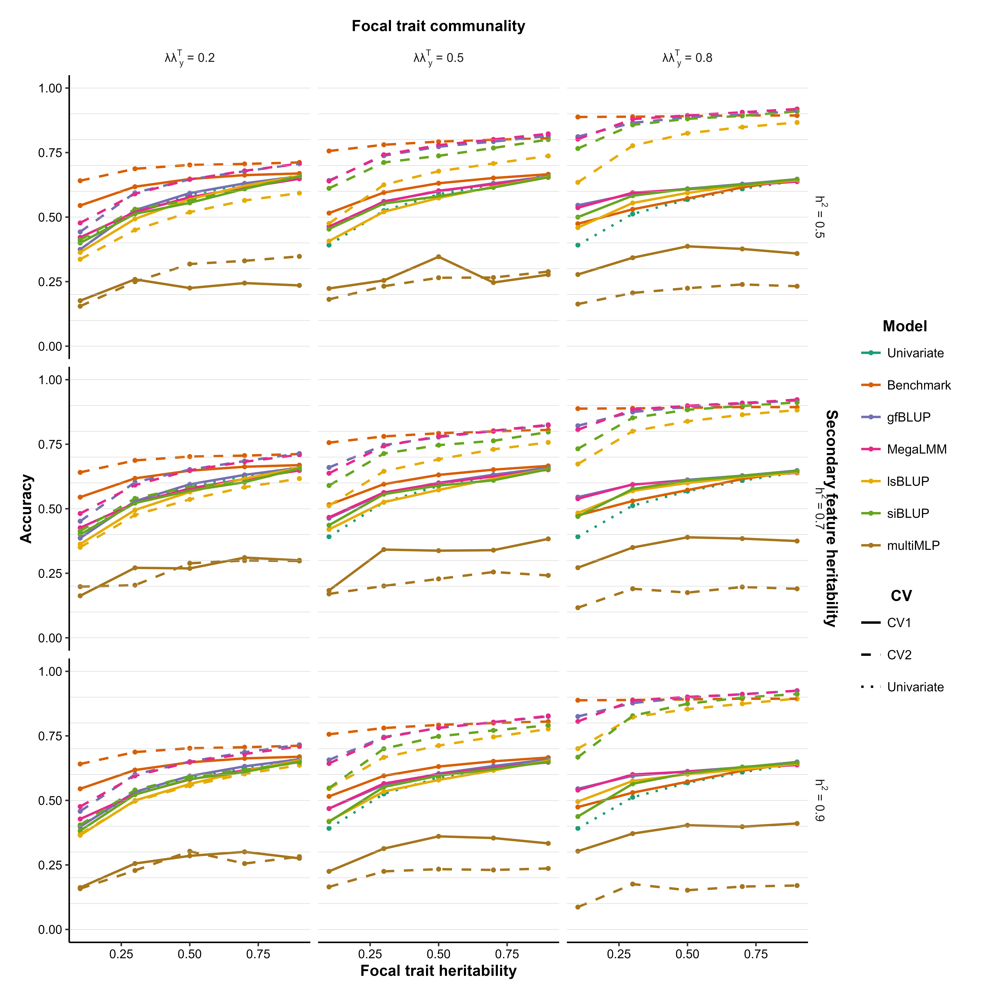
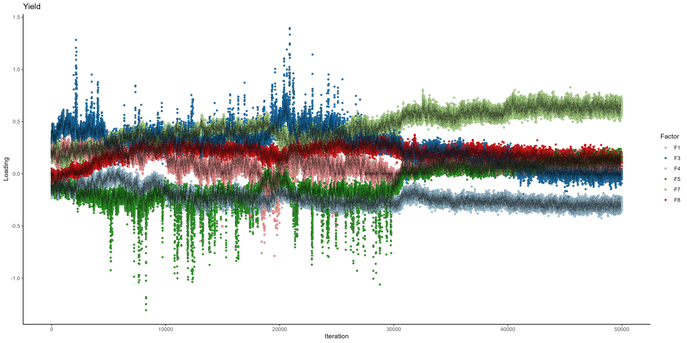

# gfBLUP 2024

Contains all scripts required to generate the simulated, hyperspectral, and timing data. Also contains scripts to analyze the datasets using different methods and visualize the results.

## 1 - High-dimensional p800 simulated data

This section provides information on the generation and analysis of the high-dimensional simulated data. All required scripts can be run at once using the [`run_all_p800.R`](run_all_p800.R) script. It might be better to source the various scripts one after the other as running all in one go might take too long.

### 1.1 - Data simulation

Two scripts are used to generate that data. The first one ([`generate_sim_p800_datasets.R`](p800/data_generation/generate_sim_p800_datasets.R)) simulates the actual data based on the factor model while [`traintest_sim_p800_datasets.R`](p800/data_generation/traintest_sim_p800_datasets.R) randomly divides each dataset into a training and test set. Note that these scripts can be run in WSL2 using Intel's oneMKL BLAS and LAPACK libraries. In that case `MKL_DYNAMIC` and `MKL_NUM_THREADS` must be set to `FALSE` and `3`, respectively. This assumes a 20 thread system (5 parallel processes each using 3 threads for MKL). For an 8 thread system `MKL_NUM_THREADS` should be set to `1`.

### 1.2 - Data analysis

[`run_all_p800.R`](run_all_p800.R) sources all scripts to analyze the generated data using different methods, as well as some scripts to merge results for methods that are run in multiple parts due to their long runtime. As an example, [`gfBLUP_part1.R`](p800/analyses/gfBLUP_part1.R) is responsible for analyzing the first 50 datasets for each of the combinations of focal/secondary trait heritabilities and focal trait communalities. The second 50 datasets are analyzed using [`gfBLUP_part2.R`](p800/analyses/gfBLUP_part2.R) after which the results are merged using [`gfBLUP_merge.R`](p800/misc/gfBLUP_merge.R). Note that if running the scripts in WSL2 using oneMKL, it is safest to set `MKL_NUM_THREADS=1` and `MKL_DYNAMIC=FALSE` to avoid issues with parallelization.

### 1.3 - Result visualization

The results of all p800 analyses are visualized using [`plot_p800_results.R`](p800/plot_p800_results.R). The produced plot (p800.png) is placed in the base directory.



## 2 - Hyperspectral data

This section provides information on the pre-processing and analysis of the CIMMYT hyperspectral data.

### 2.1 - Data pre-processing

Placeholder

### 2.2 - Data analysis

Placeholder

### 2.3 - Result visualization

Placeholder

### 2.4 - Interpretation of factor loadings for a single date

Placeholder

## 3 - Timing data

This section provides information on the generation of the data used to visualize the computational times of gfBLUP as p grows.

### 3.1 - Data simulation

Placeholder

### 3.2 - Timing

Placeholder

### 3.3 - Result visualization

Placeholder

# Supplementary Material

Some extra material related to MegaLMM.

## S1 - MegaLMM

This section contains some additional results related to the behavior of the MegaLMM posterior sampling chains for the loadings of yield and the hyperspectral wavelengths for several numbers of factors.

### S1.1 - Example data

All results are obtained using the first hyperspectral dataset generated in [Section 2.1](https://github.com/KillianMelsen/gfBLUP_2024/tree/main?tab=readme-ov-file#21---data-pre-processing). We use the kinship matrix (1032 genotypes) from this section as well. Furthermore, we focus on one single data of hyperspectral measurements (150310) resulting in 63 features total (yield + 62 wavelengths). Training data is scaled and centered, with no redundancy filtering taking place.

### S1.2 - Sampling

We assess the chain behavior for `M = 5, 10, 20, and 50` factors. Posterior sampling takes place using a thinning rate of 2. We first collect 10,000 burn-in samples, reordering the factors every 1000 iterations. We run another 100,000 iterations to collect 50,000 posterior samples for the loadings and predictions. Beyond the number of factors and thinning rate we use mostly default settings and priors with a single random genetic effect:

``` r
run_parameters <- MegaLMM::MegaLMM_control(
    drop0_tol = 1e-10,
    scale_Y = FALSE,
    h2_divisions = 20,
    h2_step_size = NULL,
    burn = 0,
    K = M,
    save_current_state = TRUE,
    thin = 2
  )
  
  priors = MegaLMM::MegaLMM_priors(
    tot_Y_var = list(V = 0.5, nu = 10),
    tot_F_var = list(V = 18/20, nu = 100000),
    Lambda_prior = list(
      sampler = MegaLMM::sample_Lambda_prec_horseshoe,
      prop_0 = 0.1,
      delta = list(shape = 3, scale = 1),
      delta_iterations_factor = 100
    ),
    h2_priors_resids_fun = function(h2s, n) 1,
    h2_priors_factors_fun = function(h2s, n) 1
  )
```

The [`Sampling.R`](SM_MegaLMM/Sampling.R) script in [`./SM_MegaLMM`](SM_MegaLMM) can be run to obtain all data. The MegaLMM state files are saved in the [`./SM_MegaLMM/states`](SM_MegaLMM/states) directory. Traceplots as produced by the [`MegaLMM`](https://doi.org/10.1186/s13059-021-02416-w) package are saved in [`./SM_MegaLMM/MegaLMM_traceplots`](SM_MegaLMM/MegaLMM_traceplots). The mean posterior loadings of yield are saved in simple vectors in the [`./SM_MegaLMM/mean_posterior_loadings_Y`](SM_MegaLMM/mean_posterior_loadings_Y) directory. We then determine which of the `M` factors are "useful", that is, the factors for which yield has an absolute loading higher than 0.05. Plots of the mean wavelength loadings on useful and useless factors are produced and saved in [`./SM_MegaLMM/mean_posterior_loadings_WL`](SM_MegaLMM/mean_posterior_loadings_WL).

Finally, the full posterior arrays of the loadings (50000 x `M` x 63) and the predictions (50000 x 1032 x 1) are saved in [`./SM_MegaLMM/posterior_arrays`](SM_MegaLMM/posterior_arrays). These are used for some custom traceplots to better look at the behavior of chains for important wavelength/yield by factor combinations.

Note that the posterior arrays, MegaLMM traceplots, and state directories are not present in this repository due to file size limits.

### S1.3 - Traceplotting

The [`Traceplotting.R`](SM_MegaLMM/Traceplotting.R) script in [`./SM_MegaLMM`](SM_MegaLMM) can be run to produce the custom traceplots. We first produce traceplots of the yield loadings on useful factors (absolute loading \> 0.05) for each value of `M`. We then produce a set of loading traceplots for a number of key wavelengths around 700 nm on the useful factors, again for each value of `M`. These traceplots can all be found in [`./SM_MegaLMM/custom_traceplots`](SM_MegaLMM/custom_traceplots).


